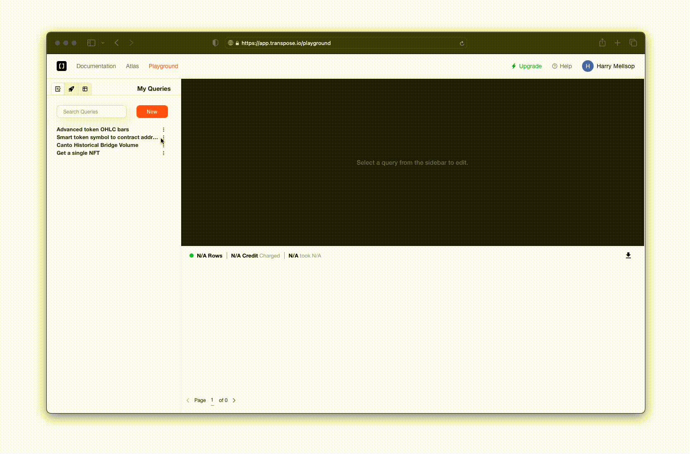

# Create a Custom Endpoint

## 1. Create a SQL Query in the Playground

To begin, let's write or create a new SQL query [in the Playground](https://app.transpose.io/playground).  This can be any valid SQL Query.

For our example, we'll be pulling the most recent 100 NFT sales on Polygon using the following simple SQL query:

``` sql
SELECT *
FROM polygon.nft_sales 
ORDER BY timestamp DESC
LIMIT 100;
```



[Open the Playground](https://app.transpose.io/playground), create a new query, and enter your SQL query.  Test the Query to make sure that it works, and give the query a descriptive name.

## 2. Deploy the Query as a Custom Endpoint

Once you've created a query, you can deploy it as a Custom Endpoint by clicking the "Deploy to Endpoint" button in the top right corner of the Playground.

You can choose to add this query as a new version for an existing endpoint, or to create a new endpoint from scratch.  For this example, we'll create a new endpoint.  Click 'New Endpoint', and give your endpoint a descriptive name.


You can choose whether to make this endpoint version public or private.  Public endpoints are shared with the community through the Atlas, while private endpoints are only accessible to you and your team.  For this example, we'll make the endpoint private.  You can read more about public endpoints, and sharing endpoints with the community by clicking the link below.

{{ transpose_colored_link(link_type='assistant', url='/custom-endpoints/atlas', text='Learn more about sharing Custom Endpoints', description='Learn how to share Custom Endpoints with the community, and use endpoints others have created.', custom_color='green', custom_icon='material-map-outline')}}

## 3. Call the Endpoint in Production

Once you've deployed your endpoint, you can call it in production using the endpoint's URL.  You can find the endpoint's URL by selecting the endpoint from the 'My Endpoints' tab in the Playground, and copying the URL from the 'Endpoint URL' field.  You can also directly copy a code snippet in the language of your choice, by clicking the 'Generate Code Snippet' button.


By default, the URL and the generated code snippets will include the default parameters for this endpoint (if any).  In this example, we haven't parameterized this endpoint, but you can learn more about parameterizing custom endpoints by clicking the link below.

{{ transpose_colored_link(link_type='assistant', url='/custom-endpoints/parameters', text='Parameterize Endpoints', description='Learn how to add parameters to your endpoint, and call the endpoint with parameters in production.', custom_color='blue', custom_icon='material-function-variant')}}

Read more about integrating Custom Endpoints into your application by clicking the link below.

{{ transpose_colored_link(link_type='assistant', url='/custom-endpoints/integrate', text='Integrate Custom Endpoints', description='Learn how to easily integrate Custom Endpoints into your application.', custom_color='red', custom_icon='material-cloud-check')}}

## 4. That's it, you're done.

Enjoy massively accelerating your development workflows, with the fastest, simplest, and most powerful backend endpoints in the industry.

{{ transpose_colored_link(link_type='discord', text='Got questions?  Join our Discord')}}
