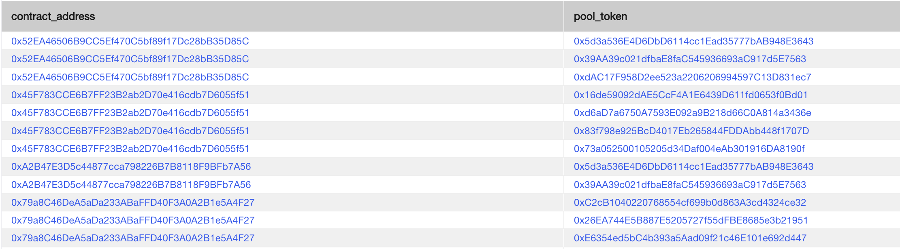
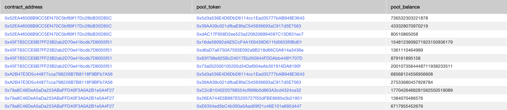
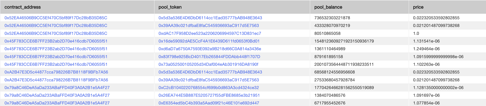
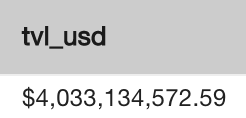

# Advanced Examples

## Goal: Calculate the latest TVL of all Curve pools.

First, we just want to get all Curve pools from the `dex_pools` table.

```sql
SELECT
  contract_address,
	pool_token
FROM ethereum.dex_pools dp
CROSS JOIN UNNEST(token_addresses) AS pool_token
WHERE exchange_name = 'curve';
```

Above, the cross join lets us take the `token_addresses` column, which is an array of token addresses per row, and expand it out to a pool `contract_address` - `pool_token` per row.



Next, we want to join the `dex_liquidity` table, using the latest values for each pool.

```sql
SELECT
	contract_address,
	pool_token,
	pool_balance
FROM ethereum.dex_pools dp
CROSS JOIN UNNEST(token_addresses) AS pool_token

CROSS JOIN LATERAL (
    SELECT
        pool_balance
    FROM ethereum.dex_liquidity dl
    WHERE dl.contract_address = dp.contract_address
    AND dl.token_address = pool_token
    ORDER BY timestamp DESC LIMIT 1
    ) dl
WHERE exchange_name = 'curve';
```

Here, we use `CROSS JOIN LATERAL`, which allows us to join the `dex_liquidity` table to the `dex_pools` table at the row level, so we can get the `pool_balance` of the `pool_token` for the pool `contract_address`, specifically the latest pool balance (as seen with the `ORDER BY timestamp DESC LIMIT 1` clause).



We can utilize `CROSS JOIN LATERAL` again here for token prices as well, join on the `token_address` and ordering `BY timestamp DESC LIMIT 1` for the latest price. 

```sql
SELECT
  contract_address,
	pool_token,
	pool_balance,
	price
FROM ethereum.dex_pools dp
CROSS JOIN UNNEST(token_addresses) AS pool_token
CROSS JOIN LATERAL (
    SELECT
        pool_balance
    FROM ethereum.dex_liquidity dl
    WHERE dl.contract_address = dp.contract_address
    AND dl.token_address = pool_token
    ORDER BY timestamp DESC LIMIT 1
    ) dl

CROSS JOIN LATERAL (
    SELECT
        price
    FROM ethereum.token_prices tp
    WHERE tp.token_address = pool_token
    ORDER BY timestamp DESC LIMIT 1
    ) tp
WHERE exchange_name = 'curve';
```



Finally, we can join the tokens table to obtain the token decimals to normalize the raw `pool_balance`, then multiply by the usd price of the token to obtain the USD TVL of each token in each pool, and sum the results to get the total pool TVL of Curve. We also use the CAST(val AS money) function to convert the output to an easy to read USD formatting.

```sql
SELECT
	CAST(SUM(price * pool_balance / 10 ^ t.decimals)::numeric AS money) AS tvl_usd
FROM ethereum.dex_pools dp
CROSS JOIN UNNEST(token_addresses) AS pool_token
CROSS JOIN LATERAL (
    SELECT
        pool_balance
    FROM ethereum.dex_liquidity dl
    WHERE dl.contract_address = dp.contract_address
    AND dl.token_address = pool_token
    ORDER BY timestamp DESC LIMIT 1
    ) dl
CROSS JOIN LATERAL (
    SELECT
        price
    FROM ethereum.token_prices tp
    WHERE tp.token_address = pool_token
    ORDER BY timestamp DESC LIMIT 1
    ) tp
JOIN ethereum.tokens t ON t.contract_address = pool_token
WHERE exchange_name = 'curve';
```

